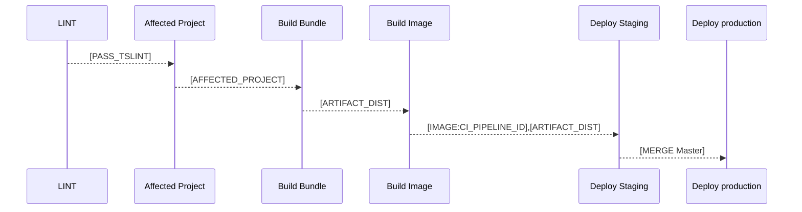

# Reactor-Room

## CI PIPELINE



## Development server

Run : `nx serve room-front-end` to run dev server for dev environment
`http://localhost:4200`

Run : `nx serve room-backend-end` to run dev server for dev environment
`http://localhost:3333/api`

Run : `npm run start:plusmar` to run frontend of Plusmar

Run : `nx serve plusmar-back-end` to run backend of Plusmar

Run : `docker-compose up` to run mongo

## Plusmar pipeline

npm run start:plusmar
sudo docker-compose up
nx serve plusmar-back-end
npm run plusmar:webhook# --> # is number

## Ngrok

./ngrok http localhost:3333 -region=ap -host-header="localhost:3333"
ngrok http localhost:3333 -region=ap -host-header="localhost:3333"

## Code scaffolding

Run `nx g c my-component --project=my-app` to generate a new component.

## Running unit tests

Run `ng test backend-end` to execute the unit tests via [Jest](https://jestjs.io).

## Before push after commit

Every commit we recommend you to run linter always.
Run `./scripts/build-checker-local.sh for check project are relate with this commit.

## Story Book

nx run #PROJECT_NAME:storybook
e.g. nx run itopplus-cdk:storybook

## Create Angular Project

nx g @nrwl/angular:app #PROJECT_NAME

## PGAdmin

`http://localhost:5050`

user : itopplus

pass : itopplus

sudo -u postgres psql

postgres=# create database mydb;

postgres=# create user myuser with encrypted password 'mypass';

postgres=# grant all privileges on database mydb to myuser;

## GCloud Command DB Connect

gcloud sql connect plusmar-sql

## Facebook Message Pipeline Follow Customer

1.[pipeline.service.ts](libs/itopplus-services-lib/src/lib/services/pipeline/pipeline.service.ts) `sendPayload()`</br>`required:` payload:[`IPayload`](libs/itopplus-model-lib/src/lib/context/context.model.ts) audienceID: `number`, PSID: `string`, payloadType: [`EnumPurchasingPayloadType`](libs/itopplus-model-lib/src/lib/purchase-order/purchase-order.model.ts)

2.Facebook Webhook Handler
3.Webview [webview.service.ts](apps/plusmar-back-end/src/services/webhook/webhook.service.ts) `handleTemplates()`</br>`required:` req: Request, res: Response
4.Postback
</br>4.1 on Postback message from should POST to [`purchase/postback`](apps/plusmar-back-end/src/routes/purchase.route.ts)
</br>4.2 on Postback button will request to [listener.service.ts](apps/plusmar-webhook/src/services/listener.service.ts) `handlePostbackFlow()` with response_type:[`EnumHandleResponseMessageType`](libs/itopplus-model-lib/src/lib/facebook/message-model/message.model.ts) in payload: [`PostbackPayload`](libs/itopplus-model-lib/src/lib/facebook/message-model/message.model.ts)

## EnumPurchaseOrderStatus

`[FOLLOW, WAITING_FOR_PAYMENT, CONFIRM_PAYMENT, WAITING_FOR_SHIPMENT, CLOSE_SALE, REJECT, EXPIRED]`

## EnumPurchasingPayloadType

`[SELECT_ORDER, SEND_CART, SEND_RECEIPT, UPDATE_CART, CONFIRM_ORDER, RECEIVE_ORDER_CONFIRMATION, LOGISTIC_SELECTOR, PAYMENT_SELECTOR, SEND_PAYMENT, SEND_BANK_ACCOUNT, PAYMENT_CONFIRMED, CHECK_ADDRESS, ADDRESS_EDITING, SEND_TRACKING_NUMBER]`

## EnumHandleResponseMessageType

`[ADD_ITEM_TO_CART, RESPONSE_CONFIRM_ORDER, SELECT_PAYMENT_METHOD, SELECT_LOGISTIC_METHOD, CORRECT_ADDRESS, IN_CORRECT_ADDRESS, ADD_ADDRESS]`

## Pipeline Flow

## 1.Bank Transfer

### 1.1 Fix Rate & 1.2 Single Logistic

`STEP_1`: SELECT_ORDER |> ADD_ITEM_TO_CART |> `(1.1 Send Shipping by Logistic Price || 1.2 Send Fix rate price)` |> SEND_RECEIPT |> CONFIRM_ORDER |> RECEIVE_ORDER_CONFIRMATION<br>
`STEP_2`: `skip to step 3 and send logistic detail to customer` |><br>
`STEP_3`: PAYMENT_SELECTOR |> SEND_PAYMENT |> SELECT_PAYMENT_METHOD |> (SEND_MESSAGE_SELECTED_PAYMENT) |> `(IF SELECT BANK_TRANSFER)`SEND_BANK_ACCOUNT<br>
`STEP_4`: RESPONSE_CONFIRM_ORDER |> PAYMENT_CONFIRMED |> CHECK_ADDRESS |><br>
`(IF CORRECT)`CORRECT_ADDRESS |>
`(ELSE)`IN_CORRECT_ADDRESS |> ADDRESS_EDITING |> ADD_ADDRESS |> CORRECT_ADDRESS |> (SEND_MESSAGE_ADDRESS_CONFIRMED) |> SEND_TRACKING_NUMBER<br>
`STEP_5`: CLOSED

### 1.2 Multiple Logistic

`STEP_1`: SELECT_ORDER |> ADD_ITEM_TO_CART |> SEND_RECEIPT |> CONFIRM_ORDER |> RECEIVE_ORDER_CONFIRMATION<br>
`STEP_2`: LOGISTIC_SELECTOR |> SELECT_LOGISTIC_METHOD |> (SEND_MESSAGE_SELECTED_LOGISTIC)<br>
`STEP_3`: PAYMENT_SELECTOR |> SEND_PAYMENT |> SELECT_PAYMENT_METHOD |> (SEND_MESSAGE_SELECTED_PAYMENT) |> `(IF SELECT BANK_TRANSFER)`SEND_BANK_ACCOUNT<br>
`STEP_4`: RESPONSE_CONFIRM_ORDER |> PAYMENT_CONFIRMED |> CHECK_ADDRESS |><br>
`(IF CORRECT)`CORRECT_ADDRESS |><br>
`(ELSE)`IN_CORRECT_ADDRESS |> ADDRESS_EDITING |> ADD_ADDRESS |> CORRECT_ADDRESS |> (SEND_MESSAGE_ADDRESS_CONFIRMED) |> SEND_TRACKING_NUMBER<br>
`STEP_5`: CLOSED

## 2. COD

`STEP_1`: SELECT_ORDER |> ADD_ITEM_TO_CART |> SEND_RECEIPT |> CONFIRM_ORDER |> RECEIVE_ORDER_CONFIRMATION<br>
`STEP_2`: LOGISTIC_SELECTOR |> SELECT_LOGISTIC_METHOD<br>
`STEP_3`: PAYMENT_SELECTOR |> SEND_PAYMENT |> SELECT_PAYMENT_METHOD`[COD]` |> (SEND_MESSAGE_SELECTED_PAYMENT) |> CHECK_ADDRESS |><br>
`(IF CORRECT)`CORRECT_ADDRESS |><br>
`(ELSE)`IN_CORRECT_ADDRESS |> ADDRESS_EDITING |> ADD_ADDRESS |> CORRECT_ADDRESS |> (SEND_MESSAGE_ADDRESS_CONFIRMED) |><br>
`STEP_4`: RESPONSE_CONFIRM_ORDER |> SEND_TRACKING_NUMBER<br>
`STEP-5`: CLOSED

## Paypal Sandbox URL

sandboxClient:AV4euy7Sk8Vwat0wwoFIjIp8pqzvmuBbS-FSLcUKrDX_da_KU5Q3aAquf0IieXC3Gy1gPmK9pi6zIwDt
sandboxSecret:EGlo0nRUUipRSVi1h7ub4MmXAIAlDLcXGD_C1zmb7BOnfPMSqhMb_wXmAOEaqXEzbi8WZ7pxy9D_ORGk
paypalSandboxEmail: sb-x471up2337588@personal.example.com
paypalSandboxPwd: mR58Gb^5

## Remove Spect Test Angular

find . -type f -name '\*.spec.ts' -delete

## Implement dot_env cli

cp ./tools/environment/.env_template ./tools/environment/.env

## Test Page Create

'https://developers.facebook.com/docs/apps/test-pages/'

```Page
{
  "about": "Arai about me it ok",
  "picture": "https://scontent.fbkk12-2.fna.fbcdn.net/v/t1.0-9/30726428_357946291370965_3558906615539171328_n.jpg?_nc_cat=104&ccb=2&_nc_sid=825194&_nc_eui2=AeG7NNnzr_Zy1RKoxrpuSnP-UWepMTVwyAFRZ6kxNXDIAY28gVpy5623vI1xkH1Hs3w&_nc_ohc=-vtsJRsKiOsAX-Oir2X&_nc_ht=scontent.fbkk12-2.fna&oh=c7a9cdf6806c7bc25bb800838c32d14c&oe=5FEC3000",
  "cover_photo": {
    "url": "https://scontent.fbkk12-2.fna.fbcdn.net/v/t1.0-9/30726428_357946291370965_3558906615539171328_n.jpg?_nc_cat=104&ccb=2&_nc_sid=825194&_nc_eui2=AeG7NNnzr_Zy1RKoxrpuSnP-UWepMTVwyAFRZ6kxNXDIAY28gVpy5623vI1xkH1Hs3w&_nc_ohc=-vtsJRsKiOsAX-Oir2X&_nc_ht=scontent.fbkk12-2.fna&oh=c7a9cdf6806c7bc25bb800838c32d14c&oe=5FEC3000"
  },
  "name": "Hello Kon MaimeeSit 2",
  "category_enum": "COMMUNITY_SERVICES"
}

Kon Mai mee Sit 1
Dorothy Alehdggbggdgh Romanberg
Page ID : 104791454814549
https://www.facebook.com/Hello-Kon-MaimeeSit-1-104791454814549/

Kon Mai mee Sit 2
Karen Alehfebbbihch Sidhuberg
Page ID : 107777494509909
https://www.facebook.com/Hello-Kon-MaimeeSit-2-107777494509909/

Kon Mai mee Sit 3
Harry Alehfggedhcab Liberg
Page ID : 104337438195152
https://www.facebook.com/Hello-Kon-MaimeeSit-3-104337438195152/

```

## Test User Account

PID : Pagename : Username : PWD
304 : GREAN_APP : User1 : 000000
238 : GELD_TONER : User2 : 000000
91 : NDSL : User3 : 000000
340 : THAILAND_ONLINE_MARKETING : User6 : 000000
355 : KUB_PHOM : User7 : 000000

## Folder for KEEP storage

FOR MAC :
User must goto system preference -> filesharing pointing to /Users (If it not there but default it should have.)
mkdir /Users/Shared/fileStorage
sudo chown -R OWNER:OWNER /Users/Shared/fileStorage
