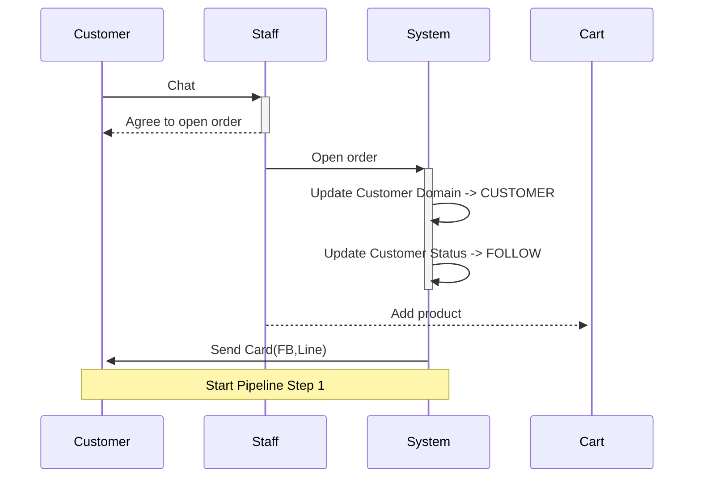
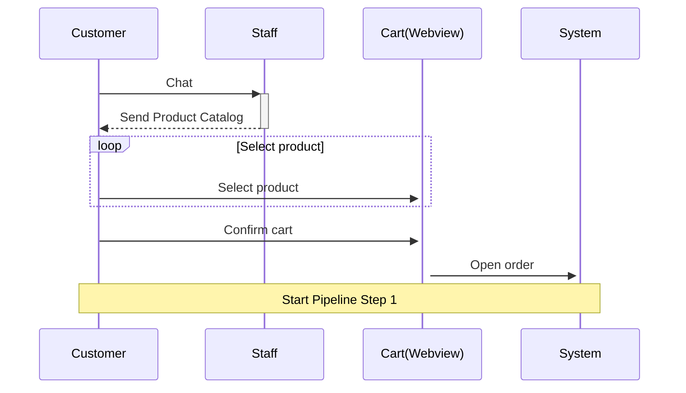
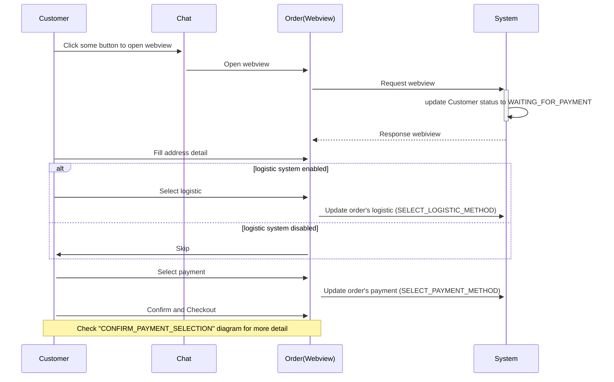
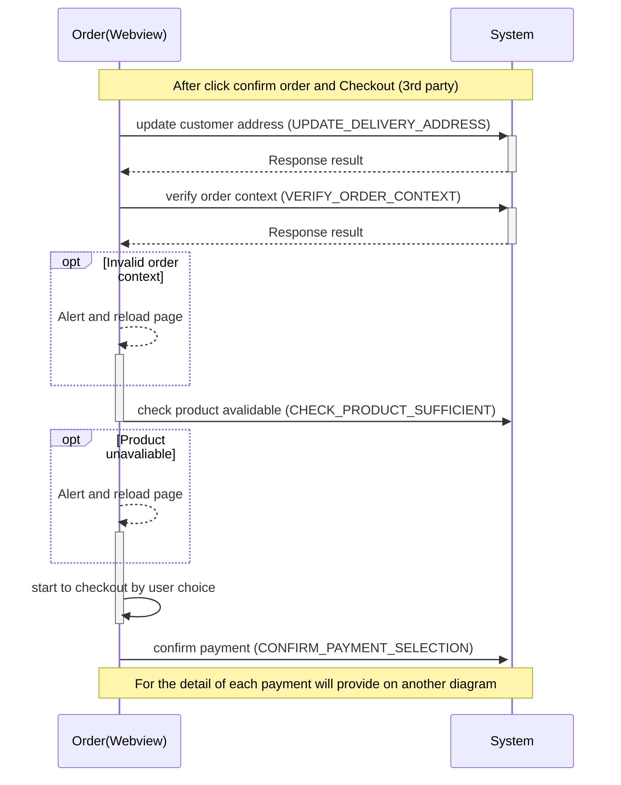

Payments System 1
[OMISE]

- https://dashboard.omise.co/test/webhooks

* ask me for USER/PWD whois ME???

# [Purchase Order Sequence Diagram]

## - Possibly ways to start order

### Way 1

### Way 2

# - Purchase Order Pipeline Step 1

## - Step 1

## - Step 1 (Extra CONFIRM_PAYMENT_SELECTION)

