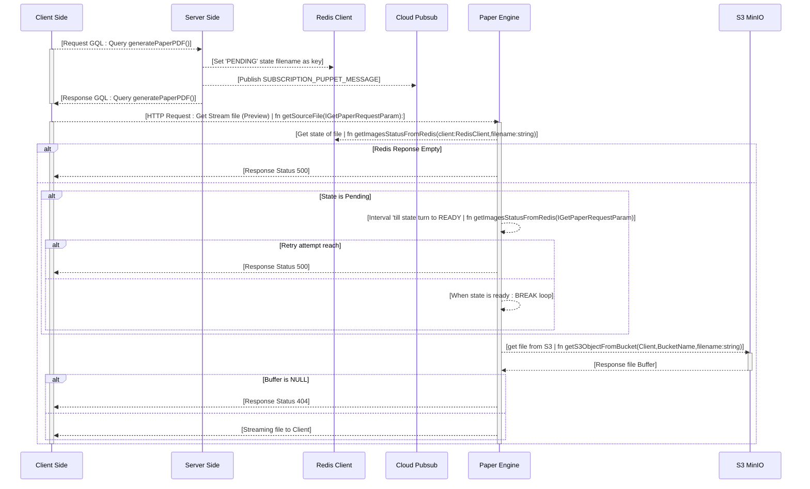
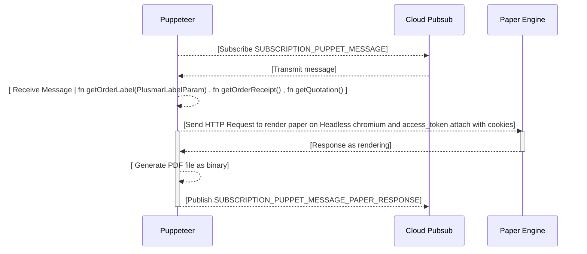
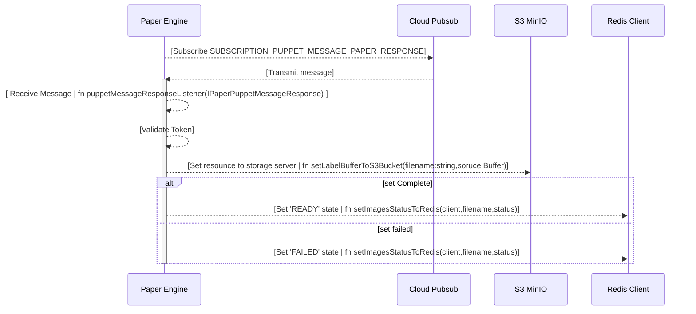

<h1>Paper Engine</h1>

Client Request

```mermaid
    sequenceDiagram
    Client Side -->> Server Side: [Request GQL : Query generatePaperPDF()]

    activate Client Side
        Server Side -->> Redis Client: [Set 'PENDING' state filename as key]

        Server Side -->> Cloud Pubsub: [Publish SUBSCRIPTION_PUPPET_MESSAGE]

        Server Side -->> Client Side: [Response GQL : Query generatePaperPDF()]
    deactivate Client Side

    Client Side -->> Paper Engine: [HTTP Request : Get Stream file (Preview) | fn getSourceFile(IGetPaperRequestParam):]

    activate Client Side
        activate  Paper Engine

        Paper Engine -->> Redis Client: [Get state of file | fn getImagesStatusFromRedis(client:RedisClient,filename:string)]

            alt Redis Reponse Empty
                Paper Engine -->> Client Side: [Response Status 500]
            else
                alt State is Pending
                    Paper Engine -->> Paper Engine: [Interval 'till state turn to READY | fn getImagesStatusFromRedis(IGetPaperRequestParam)]
                        alt Retry attempt reach
                            Paper Engine -->> Client Side: [Response Status 500]
                        else
                            Paper Engine -->> Paper Engine: [When state is ready : BREAK loop]
                        end
                end

                Paper Engine -->> S3 MinIO:[get file from S3 | fn getS3ObjectFromBucket(Client,BucketName,filename:string)]
                activate S3 MinIO
                    S3 MinIO -->> Paper Engine:[Response file Buffer]
                deactivate S3 MinIO

                alt Buffer is NULL
                    Paper Engine -->> Client Side: [Response Status 404]
                else
                     Paper Engine -->> Client Side: [Streaming file to Client]
                end
            end
        deactivate  Paper Engine
    deactivate Client Side
```

process at Cloud Function side

Accept Message Type: [PLUSMAR_QUOTATION,
PLUSMAR_RECEIPT,
PLUSMAR_LABEL]

```mermaid
    sequenceDiagram
    Puppeteer -->> Cloud Pubsub: [Subscribe SUBSCRIPTION_PUPPET_MESSAGE]
    Cloud Pubsub -->> Puppeteer: [Transmit message]

    Puppeteer -->> Puppeteer: [ Receive Message | fn getOrderLabel(PlusmarLabelParam) , fn getOrderReceipt() , fn getQuotation() ]
    Puppeteer -->> Paper Engine: [Send HTTP Request to render paper on Headless chromium and access_token attach with cookies]

    activate Puppeteer

        activate Paper Engine
            Paper Engine -->> Puppeteer: [Response as rendering]
        deactivate Paper Engine

        Puppeteer -->> Puppeteer:[ Generate PDF file as binary]
        Puppeteer -->> Cloud Pubsub: [Publish SUBSCRIPTION_PUPPET_MESSAGE_PAPER_RESPONSE]
    deactivate Puppeteer
```

process at Paper Engine Response

```mermaid
    sequenceDiagram
    Paper Engine -->> Cloud Pubsub: [Subscribe SUBSCRIPTION_PUPPET_MESSAGE_PAPER_RESPONSE]
    Cloud Pubsub -->> Paper Engine: [Transmit message]
    activate Paper Engine
    Paper Engine -->> Paper Engine: [ Receive Message | fn puppetMessageResponseListener(IPaperPuppetMessageResponse) ]
    Paper Engine -->> Paper Engine: [Validate Token]
    Paper Engine -->> S3 MinIO: [Set resounce to storage server | fn setLabelBufferToS3Bucket(filename:string,soruce:Buffer)]
    alt set Complete
        Paper Engine -->> Redis Client: [Set 'READY' state | fn setImagesStatusToRedis(client,filename,status)]
    else set failed
        Paper Engine -->> Redis Client: [Set 'FAILED' state | fn setImagesStatusToRedis(client,filename,status)]
    end
    deactivate Paper Engine
```

b2
