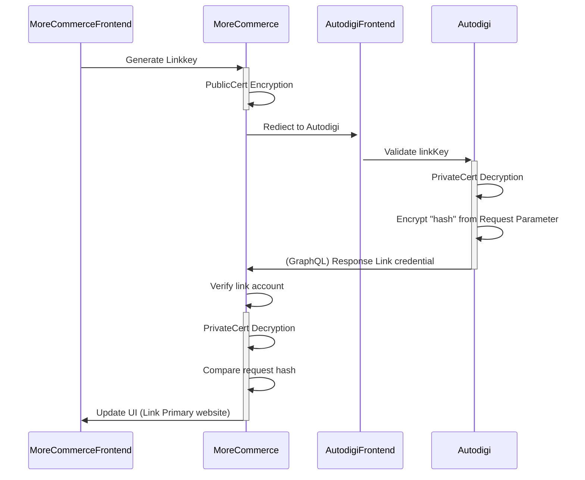

# autodigi-services-lib

This library was generated with [Nx](https://nx.dev).

## Running unit tests

Run `nx test autodigi-services-lib` to execute the unit tests via [Jest](https://jestjs.io).

```mermaid
sequenceDiagram
    MoreCommerceFrontend->>+MoreCommerce : Generate Linkkey
    MoreCommerce->>-MoreCommerce : PublicCert Encryption
    MoreCommerce->>+AutodigiFrontend : Rediect to Autodigi
    AutodigiFrontend->>+Autodigi:Validate linkKey
    Autodigi->>Autodigi: PrivateCert Decryption
    Autodigi->>Autodigi: Encrypt "hash" from Request Parameter
    Autodigi->>-MoreCommerce: (GraphQL) Response Link credential
    MoreCommerce->>+MoreCommerce: Verify link account
    MoreCommerce->>MoreCommerce: PrivateCert Decryption
    MoreCommerce->>MoreCommerce: Compare request hash
    MoreCommerce->>-MoreCommerceFrontend: Update UI (Link Primary website)

```
