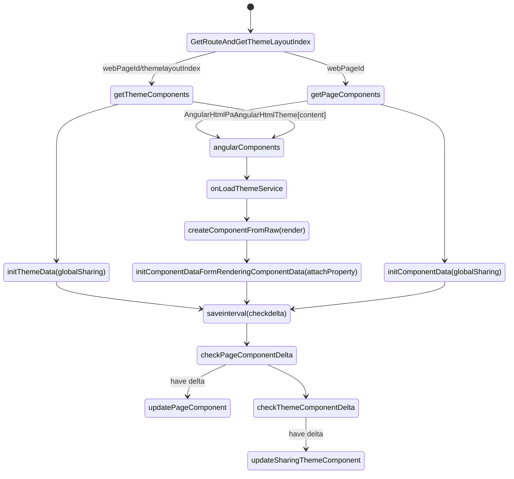

# StageDiagram

## The rendering stage Diagram version

```mermaid
stateDiagram-v2
    [*] --> GetRouteAndGetThemeLayoutIndex
    GetRouteAndGetThemeLayoutIndex --> getThemeComponents: webPageId/themelayoutIndex
    GetRouteAndGetThemeLayoutIndex --> getPageComponents: webPageId
    getThemeComponents --> initThemeData(globalSharing)
    angularComponents --> onLoadThemeService
    getPageComponents --> initComponentData(globalSharing)
    getPageComponents --> angularComponents : AngularHtmlPage
    getThemeComponents --> angularComponents : AngularHtmlTheme[content]
    onLoadThemeService --> createComponentFromRaw(render)
    createComponentFromRaw(render) --> initComponentDataFormRenderingComponentData(attachProperty)
    initThemeData(globalSharing) --> saveinterval(checkdelta)
    initComponentDataFormRenderingComponentData(attachProperty) --> saveinterval(checkdelta)
    initComponentData(globalSharing) --> saveinterval(checkdelta)
    saveinterval(checkdelta) --> checkPageComponentDelta
    checkPageComponentDelta  --> updatePageComponent: have delta
    checkPageComponentDelta --> checkThemeComponentDelta
    checkThemeComponentDelta --> updateSharingThemeComponent: have delta
```
