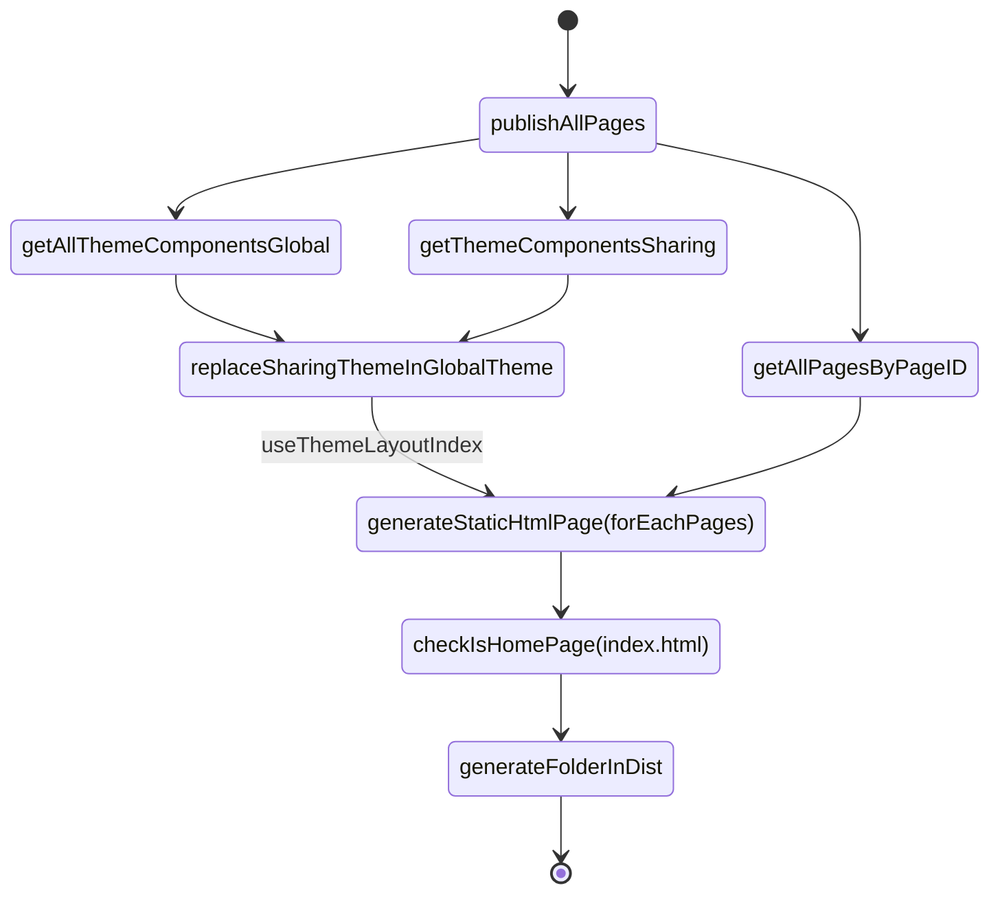

# StageDiagram

## The stage Diagram publish button in backend

```mermaid
stateDiagram-v2
    [*] --> publishAllPages
    publishAllPages --> getAllThemeComponentsGlobal
    publishAllPages --> getThemeComponentsSharing
    getAllThemeComponentsGlobal --> replaceSharingThemeInGlobalTheme
    getThemeComponentsSharing --> replaceSharingThemeInGlobalTheme
    replaceSharingThemeInGlobalTheme --> generateStaticHtmlPage(forEachPages):useThemeLayoutIndex
    publishAllPages --> getAllPagesByPageID
    getAllPagesByPageID --> generateStaticHtmlPage(forEachPages)
    generateStaticHtmlPage(forEachPages) --> checkIsHomePage(index.html)
    checkIsHomePage(index.html) --> generateFolderInDist
    generateFolderInDist --> [*]
```
